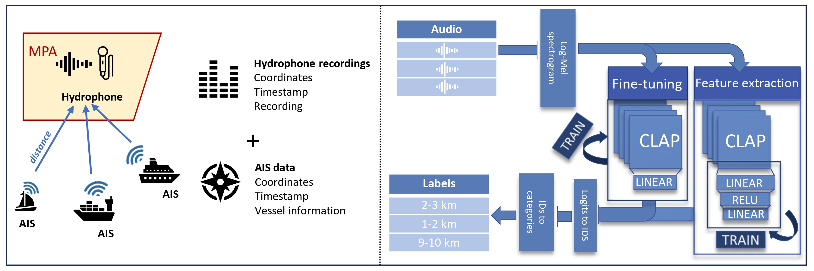
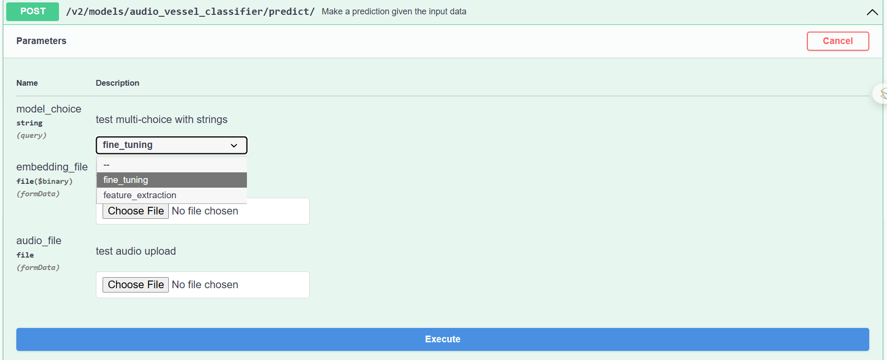

# Audio Vessel Classifier

[](https://jenkins.services.ai4os.eu/job/AI4OS-hub/job/audio-vessel-classification/job/main/)

## Project Overview
The Audio Vessel Classifier is a deep learning project designed to monitor vessel activity in marine environments using passive acoustic recordings. It processes 10-second audio clips recorded underwater and predicts the distance to the nearest vessel. This information supports marine conservation, shipping traffic analysis, and assessing human impact on sensitive ecosystems. More information can be found in the associated publication:

**DOI:** [10.1109/JSTARS.2025.3593779](https://doi.org/10.1109/JSTARS.2025.3593779)  

### Data Preparation
To prepare the data for distance classification, audio recordings were segmented into 10-second, non-overlapping windows. Each segment was categorized based on its proximity to the nearest vessel. The distance categories were divided into 1 km bins:

### Model Approaches
The project leverages the **Contrastive Language-Audio Pretraining (CLAP-LAION)** model, which is built upon the original CLAP architecture. The pre-trained CLAP-LAION model named **Biolingual**, partly trained on underwater bioacoustic data, was used for transfer learning following two approaches:

1. **Feature Extraction**  
   - High-level features were extracted from Log-Mel spectrograms using the pre-trained layers.  
   - Extracted features were passed through three custom layers for classification.  
   - Computationally efficient, requiring adjustment only to the final layers.

2. **Fine-Tuning**  
   - Pre-trained weights were used for initialization, but the entire model was retrained.  
   - Followed by a single linear layer for distance classification.  
   - Expected to achieve slightly better performance due to retraining all layers but is significantly more computationally demanding.  

This trade-off between computational efficiency and performance is important when selecting the approach. Feature extraction allows fast adaptation with limited resources, while fine-tuning can maximize predictive accuracy at higher computational cost.

  <!-- Replace with your actual image path -->


### Model weights

The model weights can be found here: 


## Model Input & Output (I/O)

The Audio Vessel Classifier can accept two types of input:

1. **Raw 10-second audio files**  
   - Users can upload a `.wav` file containing 10 seconds of underwater audio.  
   - The model will process the audio, extract Log-Mel spectrograms, generate embeddings (if using the feature extraction approach), and predict the distance category.  

2. **Pre-computed CLAP embeddings**  
   - Users who already have embeddings extracted from the CLAP-LAION model can upload these directly.  
   - This option skips the feature extraction step and allows faster inference for users with pre-processed data.

### Input Format
- **Audio file**: `.wav`, 10 seconds long, mono channel recommended.  
- **Embedding**: 1D or 2D numpy array or tensor, matching the output dimensions of the pre-trained CLAP-LAION embedding layer.

### Output Format
The model outputs a **distance category** corresponding to the proximity of the nearest vessel:
- 0-1 km
- 1-2 km
- 2-3 km
- 3-4 km
- 4-5 km
- 5-6 km
- 6-7 km
- 7-8 km
- 8-9 km
- 9-10 km
- 10+ km


## Launch

To launch it, first install the package then run [deepaas](https://github.com/ai4os/DEEPaaS):
```bash
git clone https://github.com/ai4os-hub/audio_vessel_classifier
cd audio_vessel_classifier
pip install -e .
deepaas-run --listen-ip 0.0.0.0
```


  <!-- Replace with your actual image path -->

After launching, you can choose the model approach:

- **Feature Extraction (FE)**: Faster, less computationally demanding.
- **Fine-Tuning (FT)**: Recommended for higher precision.

You can also select the input type:

- **Raw 10-second audio file** (`.wav`): The model will process the audio, generate embeddings, and predict the distance category.
- **Pre-computed CLAP embedding**: Upload embeddings directly for faster inference.

The model outputs:

- **Distance category**: 0-1 km, 1-2 km, 2-3 km, 3-4 km, 4-5 km, 5-6 km, 6-7 km, 7-8 km, 8-9 km, 9-10 km, 10+ km

## Project structure
```
│
├── Dockerfile             <- Describes main steps on integration of DEEPaaS API and
│                             audio_vessel_classifier application in one Docker image
│
├── Jenkinsfile            <- Describes basic Jenkins CI/CD pipeline (see .sqa/)
│
├── LICENSE                <- License file
│
├── README.md              <- The top-level README for developers using this project.
│
├── VERSION                <- audio_vessel_classifier version file
│
├── .sqa/                  <- CI/CD configuration files
│
├── audio_vessel_classifier    <- Source code for use in this project.
│   │
│   ├── __init__.py        <- Makes audio_vessel_classifier a Python module
│   │
│   ├── api.py             <- Main script for the integration with DEEPaaS API
│   |
│   ├── config.py          <- Configuration file to define Constants used across audio_vessel_classifier
│   │
│   └── misc.py            <- Misc functions that were helpful accross projects
│
├── data/                  <- Folder to store the data
│
├── models/                <- Folder to store models
│   
├── tests/                 <- Scripts to perfrom code testing
|
├── metadata.json          <- Metadata information propagated to the AI4OS Hub
│
├── pyproject.toml         <- a configuration file used by packaging tools, so audio_vessel_classifier
│                             can be imported or installed with  `pip install -e .`                             
│
├── requirements.txt       <- The requirements file for reproducing the analysis environment, i.e.
│                             contains a list of packages needed to make audio_vessel_classifier work
│
├── requirements-test.txt  <- The requirements file for running code tests (see tests/ directory)
│
└── tox.ini                <- Configuration file for the tox tool used for testing (see .sqa/)
```